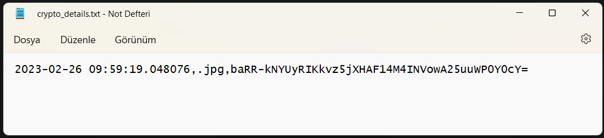
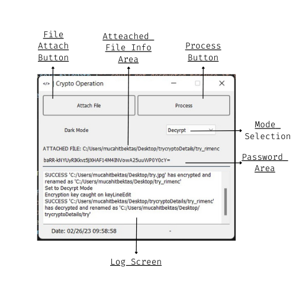

<br>
<p align="center">
	
</p>
<br>

# <p align="center">PyCryptoApp v1


<p align="center">
<a href="https://github.com/mucahitbektas"></a>
 <a href="https://github.com/mucahitbektas/Encrypt-Decrypt-Applicaton"></a>
</a>
</p>

<br>
<p align="center">
	
</p>
<br>

# Encrypt-Decrypt-Applicaton
It is an encryption and decryption application encoded in Python language. The application interface is prepared using PyQT5.

Only the following file types are allowed to be processed in the application.
After the file given in the application is encrypted, a new folder is opened in the parent directory where the file is located, and the encrypted file and encryption information are saved. The .txt file type was used while recording the encryption information.

```
ALLOWED_FILES = [".txt",".png",".jpg",".jpeg",".gif",".doc","docx",".mp4",".mp3",".pdf",".odt",".xls",".xlsx",".json",".php",".exe",".sql",".csv",".xml",""]
```
<br>

<p align="center">
	
</p>

<br>

# Multi-Mail-Sender

```
1- Each time the application is opened, a new password consisting of 44-digit letters, numbers and allowed symbols will be created. This password is your encrpyt-decrpyt password. (If you are going to encypt, you need to write down this password to decrpyt the file again.)

2- Select the encrypt or decrypt mode according to the operation you will do. (Buttons will not be active without selecting the mode.) 

3- Click the 'Attach File' button and select the file to be encrypted that you prepared before.

4- Click the 'Process' button. You can follow the records related to the transaction on the log screen.
```

<br>
<p align="center">
	
</p>

<br>

# Contact with me:
<p align="center">
<a href="mailto:m.bektastr@gmail.com">
</a>  
<a href="https://www.linkedin.com/in/mucahitbektas/"></a>  
<a  href="https://www.instagram.com/mucahitbektas_/"> </a>
 <a  href="https://www.mucahitbektas.com/"></a>
 </p>